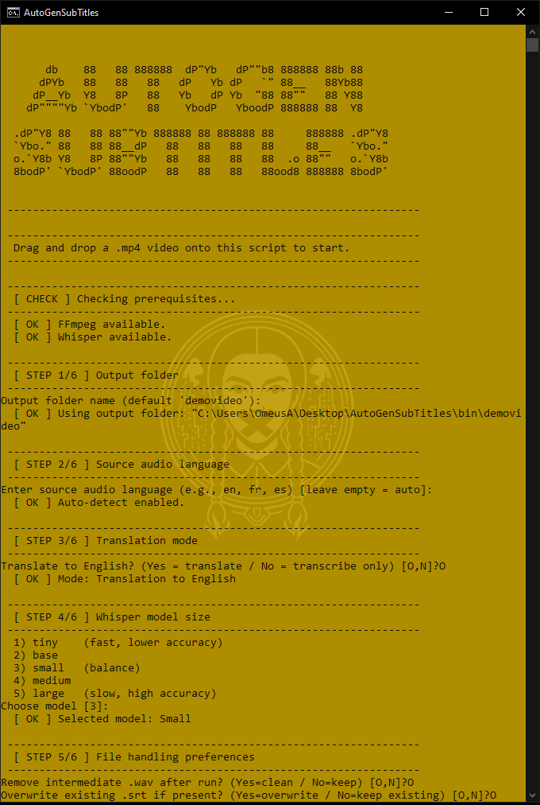
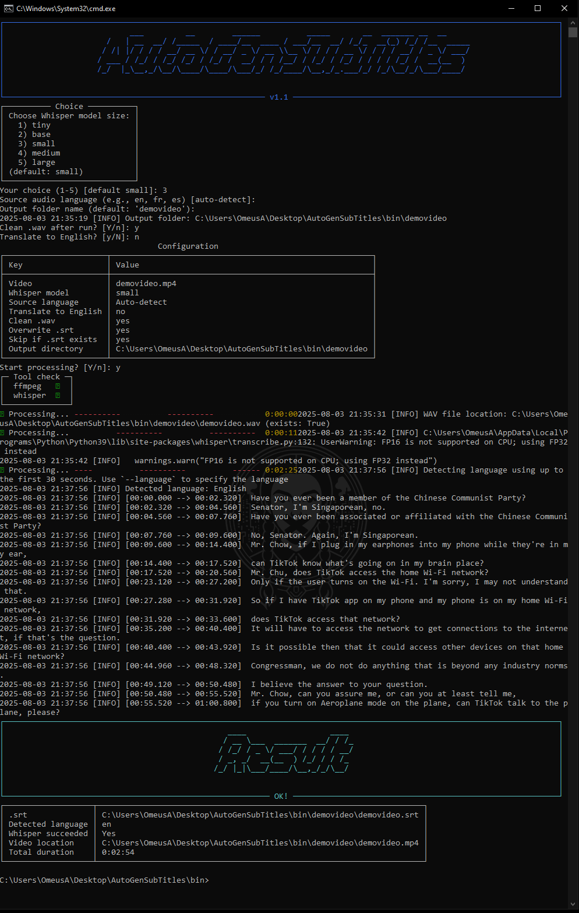

# Offline/Local Subtitle Generator with Whisper and FFmpeg (Windows/Linux)

[](https://www.python.org/)
[](https://ffmpeg.org/)
[](https://github.com/openai/whisper)
[](#)
[](#)
[](#)
[](#)

This repository contains a complete guide and batch/Python scripts to automatically generate subtitle files from `.mp4` videos using FFmpeg and OpenAI Whisper.

Whisper can transcribe the audio from your video in its original language. Optionally, it can translate the transcription to English.  
---> [Whisper on GitHub](https://github.com/openai/whisper)

### 💡 Note: Whisper runs locally

Whisper (open-source version) runs **100% locally** on your machine.  
No audio or video data is sent to OpenAI or any external server: transcription and translation are performed directly on your **CPU** or **GPU**.

**Advantages:**  
- **Free and unlimited** – no quotas or hidden costs  
- **Private** – your files stay on your machine  
- **Speed** – Whisper automatically detects your hardware and uses the GPU if available (CUDA/ROCm).  
  - If your GPU supports FP16, execution is faster and uses less memory.  
  - If FP16 is unsupported, it automatically falls back to FP32.  
  - If no compatible GPU is found, it switches automatically to CPU.  
- **Offline** – works without an internet connection once installed  

  ℹ️ Whisper models are downloaded automatically on first use, then cached for subsequent runs.


### ⚠️ **Limitation of Whisper translation**

In translation mode (`--task translate`), Whisper **always** translates transcription **to English**, regardless of the source language.  
There is no built-in option to translate directly to French or any other language.

If you want subtitles in another language, the recommended method is:  
1. **Transcribe only** (`--task transcribe`) to get a `.srt` file in the original language.  
2. Use an external tool to translate the `.srt` to your desired language.  
   - Online example: [https://translate-subtitles.com/](https://translate-subtitles.com/)

---

## 📋 Prerequisites

- Windows 10 or later  
- Python 3.9+ (with pip)  
- FFmpeg (build essentials)  
- Internet connection (to install Whisper dependencies)  
- Whisper installed via `pip`  
- Rich / Pyfiglet (Python script only)  

---

## 1. Installation

### 1.1 Install Python

- Download Python: [https://www.python.org/downloads/](https://www.python.org/downloads/)  
- During installation, **check "Add Python to PATH"**

### 1.2 Install FFmpeg

- Download FFmpeg (build essentials): [https://www.gyan.dev/ffmpeg/builds/ffmpeg-release-essentials.zip](https://www.gyan.dev/ffmpeg/builds/ffmpeg-release-essentials.zip)  
- Extract to a simple folder (e.g., `C:\Tools\ffmpeg\`)  
- Verify executable with `ffmpeg.exe -version` in a terminal opened in that folder

### 1.3 Install Whisper and Python dependencies

Open a terminal (cmd or PowerShell) and run:

```bash
python -m pip install --upgrade pip
pip install git+https://github.com/openai/whisper.git
pip install ffmpeg-python
pip install rich pyfiglet
```

## 2. Usage

### 2.1 Separate commands

```bash
# 1. Extract audio as WAV optimized for Whisper
ffmpeg -i myvideo.mp4 -ar 16000 -ac 1 -c:a pcm_s16le audio.wav

# 2. Transcribe audio to subtitles (in the audio language)
whisper audio.wav --model small --language en

# 3. Transcribe + translate to English (e.g., French video, English subtitles)
whisper audio.wav --model small --language fr --task translate
```
## 💡 Quick usage tip

To simplify the workflow, place **FFmpeg**, your `.mp4` video, and the script (`.bat` or `.py`) in the same folder.  
- For the batch script: just **drag and drop your video onto the `.bat` file**.  
- For the Python script: open this folder in Explorer, click the address bar, type `cmd` and press Enter to open a console already positioned there.
-  Then just run the Python command to launch the script, for example:
  
```bash
python gen_subs.py my_video.mp4
```


### 2.2 Automatic `.bat` script (drag and drop)

Place this `gen_subs.bat` file in the same folder as `ffmpeg.exe` and your `.mp4` videos.  
Drag and drop a video onto it: the script will extract audio, run Whisper to transcribe and translate, then delete the temporary audio.

### Batch script preview

<p align="center">
  
</p>

---

### 2.3 Output
- Several types of files are generated in the same folder as the video, including:

  `.srt` (SubRip) – The most common subtitle format, compatible with most video players (like VLC).

  `.json` (JavaScript Object Notation) – A structured data format, useful for app integration.

  `.txt` (plain text) – A simple text transcription.

  `.tsv` (Tab Separated Values) – A simple table format separated by tabs.

  `.vtt` (WebVTT) – Another subtitle format often used for the web.

- For video playback:

  - If the `.srt` file has the exact same name as the video (e.g., my_video.mp4 and my_video.srt), VLC Media Player will load it automatically.

  - Otherwise, you can manually load the `.srt` file in VLC via: Menu → Subtitles → Add Subtitle File…

---

## 3. Notes

- **Speed vs accuracy**:
  - `--model tiny` → very fast, less accurate
  - `--model small` → fast and accurate for most use cases
  - `--model medium` or `large` → very accurate, but slower
- **Source language**:
  - Here `--language en` indicates the audio is in English.
  - Change it if the video is in another language (e.g., `--language fr`).
- **Translation**:
  - `--task translate` automatically translates **to English**.
  - To translate to another language, transcribe first (`--task transcribe`), then use an external translation tool.
- The script deletes the temporary `.wav` after `.srt` generation to keep the folder clean.
 
### Performance and Time Estimation

- Running on full CPU with an Intel Xeon 5690 (very old) using single-precision floating point (F32) and the Whisper Tiny model, the complete processing of a *42-minute video took about 17 minutes* to generate the `.srt` file.

- This corresponds to roughly `40%` of the video's actual duration, meaning the script runs at just under half of real-time speed.

- Performance may vary depending on CPU/GPU power, the Whisper model size used, and the video length.  
On newer machines or with a compatible GPU, significantly faster processing times can be expected.

---

## 4. Quick usage example

1. Drag `my_video.mp4` onto `gen_subs.bat`.
2. Wait for the script to finish extracting audio, transcribing, and translating.
3. Open `my_video.mp4` in VLC.  
   - If the `.srt` has the same name as the video, it will load automatically.
   - Otherwise, add it manually via the subtitles menu.

---


## 5. Interactive Python script (gen_subs.py)

- In addition to the `.bat` script, this repository includes a more advanced, interactive Python version with Rich and PyFiglet integration.

This version:

 - Automatically checks for ffmpeg and whisper in the PATH.

 - Offers an interactive mode to choose:

    - Whisper model (tiny, base, small, medium, large)

    - Source language (or auto-detect)

    - Translation to English (yes/no)

- Provides a complete summary and detected language.

### Usage

- ```
  python gen_subs.py my_video.mp4
  ```
  The script will then prompt you for the necessary choices.

You can also specify everything directly in the command line:

  ```
  python gen_subs.py my_video.mp4 --model small --language fr --translate-to-en
  ```
Available options:

  ` --model`            Whisper model size (tiny, base, small, medium, large)  
  
  ` --language, -l`     Source language ISO code (e.g., fr, en) – leave empty for auto-detect  
  
  ` --translate-to-en`  Automatically translate to English  
  
  ` --no-clean`         Keep the temporary `.wav` file  
  
  ` --log`              File to save execution report

---

### Python script preview

<p align="center">
  
</p>

---

## 🚀 Roadmap – Planned features

Here are the next steps planned to improve and expand this project:

- **Standalone executable**  
  Create an executable version (.exe for Windows, binary for Linux) to simplify usage without requiring manual Python and dependencies installation.

- **Graphical User Interface (GUI)**  
  Build a Python-based GUI (e.g., with `Tkinter`, `PyQt` or `customtkinter`) to make the tool accessible to non-technical users.

- **Integrated multilingual translation**  
  Use Whisper only for transcription, then integrate a translation library (e.g., `deep-translator`, free/local APIs) to allow direct translation into **any language**.

- **Batch processing**  
  Add the ability to automatically process **multiple videos** in a row with the same configuration.

- **Optimization for long videos**  
  Implement **chunking** to split long videos into segments to prevent memory overload and speed up processing, then **merge subtitles automatically**.

- **Performance optimizations**  
  - Support compressed or quantized Whisper models to reduce RAM usage and increase speed.  
  - Better CPU/GPU management with automatic fallback depending on detected setup (FP16 / FP32, CUDA/ROCm, CPU fallback).  

- **Additional formats**  
  Direct support for more video and audio formats (MKV, AVI, FLAC, etc.) and export to more subtitle formats.

---

<p align="center">
   Developed with ❤️ for personal use<br>
   Based on <a href="https://github.com/openai/whisper">OpenAI Whisper</a> and <a href="https://ffmpeg.org/">FFmpeg</a>.<br>
</p>


