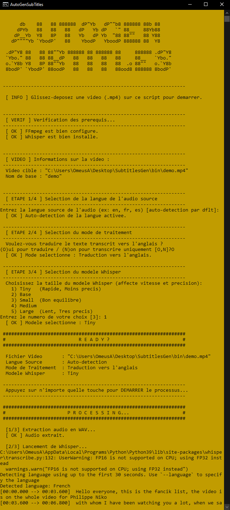
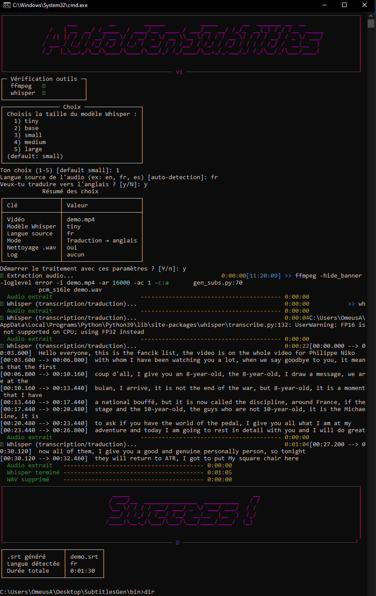

# Générateur de sous-titres offline/local avec Whisper et FFmpeg (Windows/Linux)

[](https://www.python.org/)
[](https://ffmpeg.org/)
[](https://github.com/openai/whisper)
[](#)
[](#)
[](#)
[](#)

Ce dépôt contient un guide complet et des scripts batch/python pour générer automatiquement un fichier de sous-titres à partir de vidéos .mp4, grâce à FFmpeg et OpenAI Whisper.

Whisper peut transcrire l'audio de votre vidéo dans sa langue d'origine. De plus, il offre la possibilité (optionnelle) de traduire cette transcription en anglais.
---> [Whisper sur GitHub](https://github.com/openai/whisper)

### 💡 À savoir : Whisper fonctionne en local

Whisper (en version open-source) s’exécute **100% en local** sur votre machine.  
Aucune donnée audio ou vidéo n’est envoyée à OpenAI ou à un serveur externe : la transcription et la traduction sont effectuées directement sur votre **CPU** ou votre **GPU**.

**Avantages :**  
- **Gratuit et illimité** – pas de quotas ni coûts cachés  
- **Confidentiel** – vos fichiers restent privés  
- **Rapidité** – Whisper détecte automatiquement votre matériel et utilise le GPU si disponible (CUDA/ROCm).  
  - Si votre GPU prend en charge le FP16, l’exécution est encore plus rapide et économe en mémoire.  
  - Si FP16 n’est pas supporté, il passe automatiquement en FP32.  
  - En l’absence de GPU compatible, il bascule automatiquement sur le CPU.  
- **Hors-ligne** – fonctionne même sans connexion internet une fois installé  

  ℹ️ Les modèles Whisper sont téléchargés automatiquement lors de la première utilisation, puis mis en cache pour les exécutions suivantes.


### ⚠️ **Limitation de Whisper sur la traduction**  

En mode traduction (`--task translate`), Whisper convertit **toujours** la transcription **vers l’anglais**, quelle que soit la langue source.  
Il n’existe pas d’option intégrée pour traduire directement vers le français ou une autre langue.

Si vous souhaitez obtenir vos sous-titres dans une autre langue, la méthode recommandée est :  
1. **Transcrire uniquement** (`--task transcribe`) pour obtenir un fichier `.srt` dans la langue d’origine.  
2. Utiliser un outil externe pour traduire ce `.srt` vers la langue voulue.  
   - Exemple en ligne : [https://translate-subtitles.com/](https://translate-subtitles.com/)

---

## 📋 Prérequis

- Windows 10 ou supérieur
- Python 3.9+ (avec pip)
- FFmpeg (build essentials)
- Connexion internet (pour l’installation des dépendances Whisper)
- Whisper installé via `pip`
- Rich / Pyfiglet (python script only)

---


## 1. Installation

### 1.1 Installer Python

- Télécharger Python : [https://www.python.org/downloads/](https://www.python.org/downloads/)
- Lors de l'installation, **cochez "Add Python to PATH"**

### 1.2 Installer FFmpeg

- Télécharger FFmpeg (build essentials) : [https://www.gyan.dev/ffmpeg/builds/ffmpeg-release-essentials.zip](https://www.gyan.dev/ffmpeg/builds/ffmpeg-release-essentials.zip)
- Décompressez dans un dossier simple (ex : `C:\Outils\ffmpeg\`)
- Vérifiez l’exécutable avec `ffmpeg.exe -version` dans un terminal ouvert dans ce dossier

### 1.3 Installer Whisper et dépendances Python

Ouvrez un terminal (cmd ou PowerShell) et lancez :

```bash
python -m pip install --upgrade pip
pip install git+https://github.com/openai/whisper.git
pip install ffmpeg-python
pip install rich pyfiglet
```

## 2. Utilisation

### 2.1 Commandes séparées

```bash
# 1. Extraire l’audio en WAV optimisé pour Whisper
ffmpeg -i mavideo.mp4 -ar 16000 -ac 1 -c:a pcm_s16le audio.wav

# 2. Transcrire l'audio en sous-titres (dans la langue de l'audio)
whisper audio.wav --model small --language en

# 3. Transcrire + traduire en anglais (video en francais par exemple, sous-titres en anglais)
whisper audio.wav --model small --language fr --task translate

```

### 2.2 Script `.bat` automatique (glisser-déposer)

Placez ce fichier `gen_subs.bat` dans le même dossier que `ffmpeg.exe` et vos vidéos `.mp4`.  
Glissez-déposez une vidéo dessus : le script va extraire l’audio, lancer Whisper pour transcrire et traduire, puis supprimer l’audio temporaire.

```bat
@echo off
setlocal enabledelayedexpansion

if "%~1"=="" (
  echo [!] Glisse une video dessus pour generer les sous-titres.
  pause
  exit /b
)

set "video=%~1"
set "basename=%~n1"

REM --- vérif outils ---
if not exist ffmpeg.exe (
  where ffmpeg >nul 2>&1 || (
    echo [!] ffmpeg introuvable. Mets ffmpeg.exe dans ce dossier ou ajoute-le au PATH.
    pause
    exit /b
  )
)
where whisper >nul 2>&1
if errorlevel 1 (
  echo [!] whisper introuvable. Assure-toi que Whisper est installe et que la commande "whisper" est sur le PATH.
  pause
  exit /b
)

echo -------------------------------------------------------
echo Video cible : "%video%"
echo Nom base   : "%basename%"
echo -------------------------------------------------------

REM --- langue source ---
set "lang_arg="
set /p inlang=Langue source de l'audio (ex: en, fr, es) [auto] : 
if not "%inlang%"=="" (
  set "lang_arg=--language %inlang%"
  echo [*] Langue forcee : %inlang%
) else (
  echo [*] Auto-detection de la langue activée.
)

REM --- choix transcription vs traduction vers l'anglais ---
echo.
echo Veux-tu traduire vers l'anglais (quelle que soit la langue source) ?
choice /M "Traduire vers l'anglais ?"
if errorlevel 2 (
  set "task_arg="
  echo [*] Mode : transcription seule.
) else (
  set "task_arg=--task translate"
  echo [*] Mode : traduction vers l'anglais.
)

echo.
echo [1/3] Extraction audio...
ffmpeg -hide_banner -loglevel error -i "%video%" -ar 16000 -ac 1 -c:a pcm_s16le "%basename%.wav"
if errorlevel 1 (
  echo [!] echec de l'extraction audio.
  pause
  exit /b
)

echo.
echo [2/3] Lancement de Whisper...
whisper "%basename%.wav" --model tiny %lang_arg% %task_arg%
if errorlevel 1 (
  echo [!] Whisper a echoue. Le .srt peut etre incomplet ou absent.
) else (
  echo [*] Whisper a termine.
)

echo.
echo [3/3] Nettoyage...
if exist "%basename%.wav" del "%basename%.wav" >nul 2>&1

echo.
echo -------------------------------------------------------
echo Sous-titres generes : "%basename%.srt"
echo -------------------------------------------------------
pause

```
### 2.3 Résultat
- Plusieurs types de fichiers sont générés dans le même dossier que la vidéo, incluant :

  `.srt` (SubRip) : Le format de sous-titres le plus courant, compatible avec la plupart des lecteurs vidéo (comme VLC).

  `.json` (JavaScript Object Notation) : Un format structuré pour les données, utile pour l'intégration dans des applications.

  `.txt` (texte brut) : Une simple transcription du texte.

  `.tsv` (Tab Separated Values) : Un format de tableau simple, séparé par des tabulations.

  `.vtt` (WebVTT) : Un autre format de sous-titres, souvent utilisé pour le web.

- Pour la lecture vidéo :

  - Si le fichier .srt porte exactement le même nom que la vidéo (par exemple, ma_video.mp4 et ma_video.srt), VLC Media Player le chargera automatiquement.

  - Sinon, vous pouvez charger manuellement le fichier .srt depuis VLC via : Menu → Sous-titres → Ajouter un fichier de sous-titres…

---

## 3. Notes

- **Vitesse vs précision** :
  - `--model tiny` → très rapide, moins précis
  - `--model small` → rapide et précis pour la plupart des cas
  - `--model medium` ou `large` → très précis, mais plus lent
- **Langue source** :
  - Ici `--language en` indique que l’audio est en anglais.
  - Changez-le si la vidéo est dans une autre langue (ex: `--language fr`).
- **Traduction** :
  - `--task translate` traduit automatiquement **vers l'anglais**.
  - Pour traduire vers une autre langue, transcrivez d’abord (`--task transcribe`), puis utilisez un traducteur externe.
- Le script supprime le `.wav` temporaire après génération du `.srt` pour garder le dossier propre.

---

## 4. Exemple d’usage rapide

1. Glissez `ma_video.mp4` sur `gen_subs.bat`.
2. Attendez que le script ait terminé l’extraction audio, la transcription et la traduction.
3. Ouvrez `ma_video.mp4` dans VLC.  
   - Si le `.srt` a le même nom que la vidéo, il se chargera automatiquement.
   - Sinon, ajoutez-le via le menu des sous-titres.
  
---

### Aperçus du script batch

<p align="center">
  
</p>


---


## 5. Script Python interactif (gen_subs.py)

- En plus du script .bat, ce dépôt inclut une version Python plus évoluée, interactive et visuellement enrichie grâce à Rich et PyFiglet.

Cette version :

 - Affiche une bannière ASCII rétro et des tableaux colorés.

 - Vérifie automatiquement la présence de ffmpeg et whisper dans le PATH.

 - Propose un mode interactif pour choisir :

    - Le modèle Whisper (tiny, base, small, medium, large)

    - La langue source (ou autodétection)

    - La traduction vers l’anglais (oui/non)

- Fournit un récapitulatif complet et la langue détectée.

### Utilisation

- ```
  python gen_subs.py ma_video.mp4
  ```
  Le script vous posera ensuite les questions nécessaires.


Vous pouvez aussi tout préciser en ligne de commande :
- ```
  python gen_subs.py ma_video.mp4 --model small --language fr --translate-to-en
  ```

Options disponibles :

  ` --model`            Taille du modèle Whisper (tiny, base, small, medium, large)
  
  ` --language, -l `    Code ISO de la langue source (ex: fr, en) – vide = autodétection
  
  ` --translate-to-en`  Traduire automatiquement vers l'anglais
  
  ` --no-clean`         Conserver le fichier .wav temporaire
  
  ` --log `             Fichier où enregistrer le rapport d’exécution

---

### Aperçus du script Python

<p align="center">
  
</p>


---

## 🚀 Roadmap – Évolutions prévues

Voici les prochaines étapes envisagées pour améliorer et enrichir ce projet :

- **Création d’un exécutable standalone**  
  Générer une version exécutable (.exe pour Windows, binaire pour Linux) afin de simplifier l’utilisation, sans avoir besoin d’installer Python ni les dépendances manuellement.

- **Interface graphique (GUI)**  
  Développer une interface utilisateur en Python (par exemple avec `Tkinter`, `PyQt` ou `customtkinter`) pour rendre l’outil accessible aux utilisateurs non familiers avec la ligne de commande.

- **Traduction multilingue intégrée**  
  Utiliser Whisper uniquement pour la transcription, puis intégrer une librairie de traduction (ex : `deep-translator`, API gratuites ou locales) pour permettre la traduction directe vers **n’importe quelle langue**.

- **Traitement par lot (batch)**  
  Ajouter la possibilité de traiter automatiquement **plusieurs vidéos à la suite**, avec la même configuration.

- **Optimisation pour les vidéos longues**  
  Implémenter un **découpage en chunks** (segments) des vidéos longues pour éviter la saturation mémoire et accélérer le traitement, avec **fusion automatique** des sous-titres à la fin.

- **Optimisations de performance**  
  - Support des modèles Whisper compressés ou quantifiés pour réduire l’empreinte RAM et accélérer l’exécution.  
  - Meilleure gestion CPU/GPU avec bascule automatique selon la configuration détectée (FP16 / FP32, CUDA/ROCm, fallback CPU).  

- **Formats supplémentaires**  
  Support direct pour d’autres formats vidéo et audio (MKV, AVI, FLAC, etc.) et export vers plus de formats de sous-titres.

---

<p align="center">
   Développé avec ❤️ pour un usage personnel<br>
   Basé sur <a href="https://github.com/openai/whisper">OpenAI Whisper</a> et <a href="https://ffmpeg.org/">FFmpeg</a>.<br>
</p>
